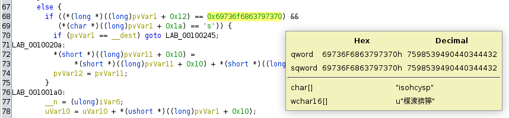

# [Cyberpsychosis](https://app.hackthebox.com/challenges/Cyberpsychosis) Writeup [HTB]
_Reverse_

## Learning about rootkits
The challenge description is explicitly telling me what to do. This is a first!

>Malicious actors have infiltrated our systems and we believe they've implanted a custom rootkit. Can you disarm the rootkit and find the hidden data?

Pretty straightforward, right? There's only one problem: I have no clue on what a _rootkit_ is.

I first look at the structure of the challenge. I can connect to a simple machine via `netcat`, and I have the source code of a `diamorphine.ko` file.

A quick Google search reveals that [Diamorphine](https://github.com/m0nad/Diamorphine) is an _LMK rootkit_. 
LMK stands for _Loadable Kernel Model_, and refers to a piece of code that can be loaded run-time to change (or extend) kernel functionalities. 

It's easy to imagine how dangerous a malicious LKM can be; for example, it can be used to hijack system calls directly in the kernel space. This means that system calls can be modified to perform extra actions, like in some kind of rotten Easter Egg.

## Original Diamorphine
Diamorphine is type of painkiller, another name for heroin, and an [LMK rootkit for Linux](https://github.com/m0nad/Diamorphine). According to the README, it comes with the following features:

>1. When loaded, the module starts invisible; 
>2. Hide/unhide any process by sending a signal 31;
>3. Sending a signal 63(to any pid) makes the module become (in)visible;
>4. Sending a signal 64(to any pid) makes the given user become root;
>5. Files or directories starting with the `MAGIC_PREFIX` become invisible;

I look at the source code for the rootkit, and I discover that it's hijacking two system calls: `kill` and `getdents`.

### Hijacked `kill`
The (simplified) code for the hijacked version of `kill` looks like this:
```c
int hacked_kill(pid_t pid, int sig) {
	struct task_struct *task;
    // switch on the signal number
	switch (sig) {
		case SIGINVIS:  /* 31 */
			if ((task = find_task(pid)) == NULL)
				return -ESRCH;
			task->flags ^= PF_INVISIBLE;
			break;
		case SIGSUPER:  /* 64 */
			give_root();
			break;
		case SIGMODINVIS:   /* 63 */
			if (module_hidden) module_show();
			else module_hide();
			break;
		default:
            return orig_kill(pid, sig);
	}
	return 0;
}
```
The function checks the signal number: if it's a "standard" value, it falls back to the original kill. Otherwise, it performs special actions, as described in the rootkit features. This is how features 2-3-4 are implemented!

### Hijacked `getdents`
`getdents`/`getdents64` is a kernel-level system call used by binaries such as `ls` and `ps`, which returns the content of a given `linux_dirent` object.
```sh
$ strace ls
execve("/usr/bin/ls", ["ls"], 0x7ffc33b35be0 /* 26 vars */) = 0
# [...]
getdents64(3, 0x62707550fab0 /* 9 entries */, 32768) = 264
getdents64(3, 0x62707550fab0 /* 0 entries */, 32768) = 0
# [...]
```

The (simplified) code for the hijacked version of `getdents` looks like this:
```c
int hacked_getdents(unsigned int fd, struct linux_dirent __user *dirent,
	    unsigned int count) {
    // first, we call the original system call
	int ret = orig_getdents(fd, dirent, count), err;

	unsigned short is_proc = 0;
	unsigned long off = 0;
	struct linux_dirent *dir;
	struct inode *d_inode;

    // if the syscall didn't return any entry (or there was an error),
    // there's no need to continue 
	if (ret <= 0)
		return ret;	
    // check if we are scanning processes (e.g., `ps`)
    // otherwise, we are scanning files/directories (e.g., `ls`)
	d_inode = current->files->fdt->fd[fd]->f_dentry->d_inode;
	if (d_inode->i_ino == PROC_ROOT_INO && !MAJOR(d_inode->i_rdev))
		is_proc = 1;
    // for each entry returned by the OG getdents
	while (off < ret) {
		dir = (void *)dirent + off;
		if (
            // target is a file and starts with the magic prefix
            (!is_proc && memcmp(MAGIC_PREFIX, dir->d_name, strlen(MAGIC_PREFIX)) == 0)
		    || /* OR */
            // target is a process and has been set as invisible
            (is_proc && is_invisible(simple_strtoul(dir->d_name, NULL, 10))
        )) {
			/* REMOVE TARGET FROM THE ENTRIES */
		} else {
			/* KEEP THE TARGET */
        }
		off += dir->d_reclen;
	}   
    return ret;
}
```
The function calls the original `getdents`, and filters its output as described in the rootkit features. This is how features 1-2-5 are implemented!

## Trying the rootkit
Now that I know what Diamorphine is, it's time to try its functionalities!

I connect to the provided machine, and I first attempt to become `root`.
```sh
~ $ whoami
whoami: unknown uid 1000
~ $ kill -64 4242
~ $ whoami
root
```
It worked!

According to the challenge description, the flag file is hidden (possibly using the `MAGIC_PREFIX` trick), meaning that I have to disable Diamorphine in order to see it.
This means I have to:
1. Make the Diamorphine module visible by sending a signal;
2. Remove it with `rmmod diamorphine`.

```sh
~ $ lsmod
# no output
~ $ kill -63 4242
sh: can't kill pid 4242
~ $ lsmod
# still no output
```
I'm not as lucky as in the `root` case, since the kill command didn't work. The Diamorphine rootkit installed on the machine is likely using a different signal number to make the module visible. 

Time to take out my faithful Ghidra and dig out the real signal number.
This is a reverse challenge after all!

## Discovering the actual signal
Luckily, the `diamorphine.ko` executable isn't stripped, so I can immediately open the `hacked_kill` disassembled function. Since I have access to the source code of the original Diamorphine, I know exactly where the signal number is.

First, I identify the variable that is involved in multiple if conditions: that variable stores the signal number (so I rename it `SIGNAL`). Then, I just need to collect the values it's compared against.
```c
/* SIMPLIFIED GHIDRA DECOMPILATION */
void hacked_kill(long param_1) {
    int SIGNAL;
    long creds;
    undefined* task;
    SIGNAL = (int)*(undefined8 *)(param_1 + 0x68);

    if (SIGNAL == 46) {
        if (module_hidden != 0) {
        // [...]
        module_hidden = 0;
        // [...]
        return;
        }
        // [...]
        module_hidden = 1;
    }
    else if (SIGNAL == 64) {
        creds = prepare_creds();
        // [...]
        return;
    }
    else if (SIGNAL == 31) {
        task = &init_task;
        // [...]
    }
    return;
}
```
From the decompiled code, it's easy to spot the "64" case, which makes me the root user, and the "31" case, which (un)hides a given task. These are both standard signal numbers (wrt the original Diamorphine).

The only case left is "46", that is clearly used to toggle the visibility of the module. I just need to send a "46" signal!
```sh
~ $ kill -46 4242
~ $ lsmod
diamorphine 16384 0 - Live 0xffffffffc027c000 (OE)
```

## Disabling the rootkit
Now I can finally get rid of the rootkit, and make the hidden files and processes visible. I'm still the root user, which is very convenient.
```sh
~ $ rmmod diamorphine
~ $ lsmod
# no output: module is gone!
~ $ whoami
root
```
I run a quick `find` to search for the flag file:
```sh
~ $ find -name flag*
./sys/devices/pnp0/00:04/tty/ttyS0/flags
./sys/devices/platform/serial8250/tty/ttyS15/flags
# [...]
./sys/devices/virtual/net/lo/flags
./opt/psychosis/flag.txt
```
I print its content and get the flag!

## [OPTIONAL] Finding out the `MAGIC_PREFIX`
From the path of the file, it's clear that "psychosis" was used as custom `MAGIC_PREFIX`. This can also be recovered from the `diamorphine.ko` file (which could have been useful had the flag been written in a file with a different name).

Similarly to the signal number, I already know which function to analyze in order to get the prefix: `hacked_getdents`. In this case, identifying the string is slightly trickier, since at first glance there are no strings (nor global variables) in the decompiled function. 

However, there is a suspiciously long hexadecimal number: if converted to characters (taking care of the endianness), it becomes equal to "psychosis"!



## References
These are some interesting websites I used to learn more about LKM rootkits and Diamorphine:
- [Linux rootkits explained – Part 2: Loadable kernel modules](https://www.wiz.io/blog/linux-rootkits-explained-part-2-loadable-kernel-modules)
- [Linux Rootkit for Fun and Profit - 0x02 - LKM - Hide files/procs](https://jm33.me/linux-rootkit-for-fun-and-profit-0x02-lkm-hide-filesprocs.html)
- [Diamorphine source code](https://github.com/m0nad/Diamorphine)
