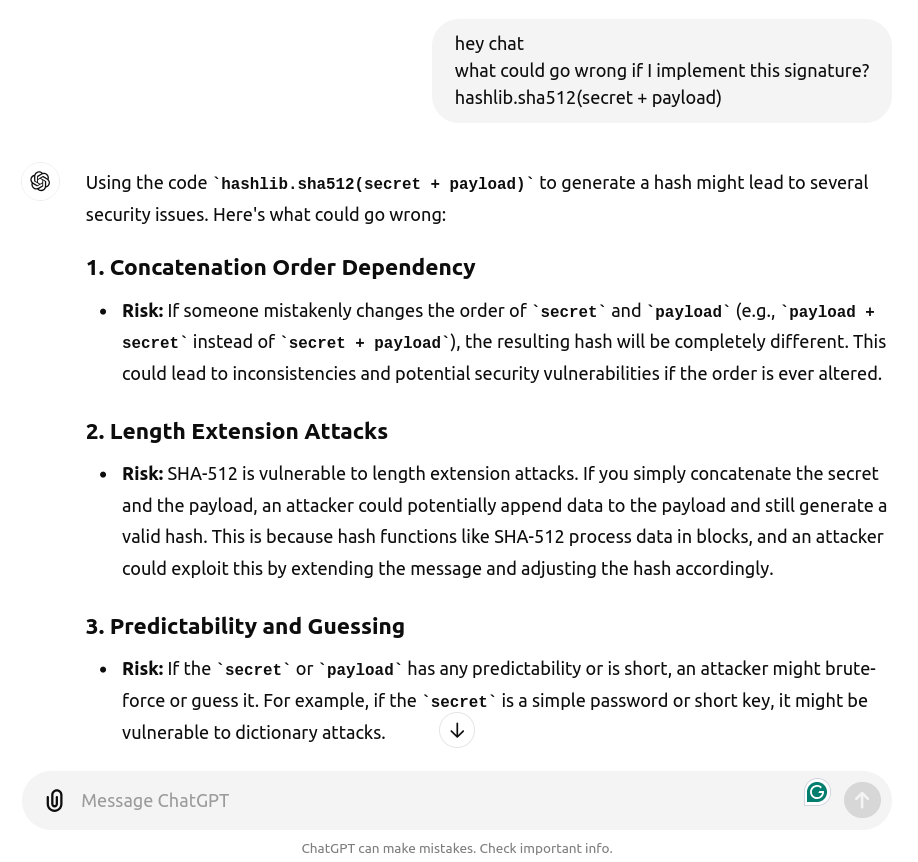

# [Protein Cookies](https://app.hackthebox.com/challenges/Protein%2520Cookies) Writeup [HTB]
_Crypto_

## Investigating the website
This challenge marks the return of real websites! This time, it's a sigma-male-grindset gym website, featuring eagles, explosions, anime girls and even a tiny The Rock. Really, play this challenge, it's worth it!

Anyway, I try to register to the website, but the process fails due to "high load". Given the title of this challenge, I look at the cookies and find this little guy:
```
login_info=dXNlcm5hbWU9Z3Vlc3QmaXNMb2dnZWRJbj1GYWxzZQ==.ZjQzYjU0ZjFhMGU0NzAwZjQxZDk0ZjRkNjVjZmU3MTc2NjkyZmIzZWI4YzU4YzA2NGY5YWMyZTM5YjYzNDFlY2EzOWM2ZmE2NWQ2NGQzOTViZTY0MWRmYmE2NjVhMDZiOTEyMzg4NzJmOTEzMmEwY2U2MWE1NDJlZDQ3NmE2MmU=
```
It's definitely base 64. I convert it and get two separate fields:
```
login_info:
    username=guest&isLoggedIn=False
    f43b54f1a0e4700f41d94f4d65cfe7176692fb3eb8c58c064f9ac2e39b6341eca39c6fa65d64d395be641dfba665a06b91238872f9132a0ce61a542ed476a62e
```
The first field is the session status, while the second looks like some kind of cryptographic signature. Time to look at that encryption!

## Studying the encryption
Since I have access to the website code, I first check the conditions to get the flag. There is a specific API providing the document I'm looking for. Problem is, I need to be logged in to call it.
```py
@web.route('/program')
@verify_login
def program():
    return send_file('flag.pdf')

# where `verify_login` is a wrapper for this session function:
def validate_login(payload):
    hashing_input, crypto_segment = payload.split('.')
    if signature.integrity(hashing_input, crypto_segment):
        return {
            k: v[-1] for k, v in urlparse.parse_qs(signature.decode(hashing_input)).items()
        }.get('isLoggedIn', '') == 'True'
    return False
```
Clearly, I cannot just change `isLoggedIn` to `True`, because that would invalidate the integrity. I have to dig deeper.
```py
secret = os.urandom(16)

class signature:
    @staticmethod
    def encode(data):
        return base64.b64encode(data)

    @staticmethod
    def decode(data):
        return base64.b64decode(data)

    @staticmethod
    def create(payload, secret=secret):
        return signature.encode(hashlib.sha512(secret + payload).hexdigest())
    
    @staticmethod
    def integrity(hashing_input, crypto_segment):
        return signature.create(signature.decode(hashing_input)) == crypto_segment
```
The signature mechanism is quite simple: the `username=guest&isLoggedIn=False` payload is concatenated to a 16B randomly generated `secret`, and then hashed using SHA-512. 

Since `secret` is quite large, I don't think bruteforcing is feasible. Moreover, the server is using `hashlib.sha512` without specifying the version, so I exclude a vulnerability in the hash implementation.
The only thing left is _how the hash is used_. 

I think I'm on the right track, but my cryptography knowledge is basically null, and I don't even know what to search on Google. So, in good old 2024 fashion, I ask ChatGPT. And for one single time in my CTF journey, I get an interesting reply:



## Explaining the attack
This _Length Extension Attack_ looks very promising, so I decide to know more. If you are a crypto-noob like me, [this GitHub page](https://github.com/iagox86/hash_extender) explains it in detail, so check it out! I will also leave my own explanation here. If you know this stuff already, feel free to skip ahead.

So, most of the hash algorithms work by separating the input in blocks, and then process each block iteratively. While doing so, they keep track of their internal status:
1. At the beginning, the status is initialized to some prime-number crypto mumbo-jumbo;
2. Every time a block is completely processed, the status is equal to the hash of the data until then.

Let's suppose, for the sake of this example, that the length of a block is 47B (the size of `secret` _plus_ the number of characters in `username=guest&isLoggedIn=False`). Now, let's say we want to append a new field `&isLoggedIn=True`, and craft its hash _without_ knowing the secret. Well, nothing easier! Since `<secret>+username=guest&isLoggedIn=False` is a full block, the internal state after computing it is known, and equal to its hash `f43b54f1...d476a62e`.
This means that we can simply hash `&isLoggedIn=True`, initializing the state to `hash(<secret>+username=guest&isLoggedIn=False)`, and get the same result as `hash(<secret>+username=guest&isLoggedIn=False&isLoggedIn=True)`!

This is some pseudo-code that shows how everything works until now:
```py
def hash(data, status=None):
    # 1. set up the status
    __status = __the_deafult_prime_number_crypto_mumbo_jumbo
    if status is not None:
        # use the provided one
        __status = status
    # 2. split into blocks
    data_blocks = get_blocks(data)
    print(data_blocks)
    # 3. hash each block
    for i, block in enumerate(data_blocks):
        __status = hash_block(block, __status)
        print(f'[{i}] block content : {block}')
        print(f'         new status : {__status}')
    # 4. return the hash (i.e., the last status)
    return __status
```

So, under our 47B assumption, we will get:
```py
h1 = hash(secret+'username=guest&isLoggedIn=False')
print(f'Hash : {h1}')
## console ##
#  [1] block content : <secret>+username=guest&isLoggedIn=False
#         new status : f43b54f1...d476a62e
#  Hash : f43b54f1...d476a62e
h2 = hash(secret+'username=guest&isLoggedIn=False&isLoggedIn=True')
print(f'Hash : {h2}')
## console ##
#  [1] block content : <secret>+username=guest&isLoggedIn=False
#         new status : f43b54f1...d476a62e
#  [2] block content : &isLoggedIn=True
#         new status : 79a47ec4...84e6c5c0
#  Hash : 79a47ec4...84e6c5c0
h3 = hash('&isLoggedIn=True', secret='f43b54f1...d476a62e')
print(f'Hash : {h3}')
## console ##
#  [1] block content : &isLoggedIn=True
#         new status : 79a47ec4...84e6c5c0
#  Hash : 79a47ec4...84e6c5c0
assert h2 == h3  # by definition
```
Wow, look at that `h3`! We managed to get the actual signature of our modified data _without_ knowing the secret.
Very cool, right? Well, there is actually a problem. 

Until now, everything worked because we assumed that blocks where 47B long. Clearly, they aren't.
Usually, blocks are 64B long, and real `hash_block` functions are made to work with _exacly_ 64B. So, what happens if our data is _less than_ 64B? This is where padding comes in!

Let's consider again our original `<secret>+username=guest&isLoggedIn=False`. Since it's less than 64B, it will be padded _before_ being processed by `hash_block`:
```
original : <secret>+username=guest&isLoggedIn=False
           |---------------- 47B -----------------|

  padded : <secret>+username=guest&isLoggedIn=False+\x00...\x00+b'47'
           |---------------- 47B ------------------|---- 9B ---|-8B-|
```
More specifically, 64-47-8 zeroed bytes are added after the original data, and finally 8 bytes are reserved for the size of the original payload (47, in this case).

This means that, when we run `hash(<secret>+username=guest&isLoggedIn=False)`, we are actually computing `hash(<secret>+username=guest&isLoggedIn=False+\x00...\x00+b'47')`. 

Let's add the padding logic to our pseudo-code:
```py
def hash(data, status=None):
    # 1. set up the status
    __status = __the_deafult_prime_number_crypto_mumbo_jumbo
    if status is not None:
        # use the provided one
        __status = status
    # 2. split into blocks
    data_blocks = get_blocks(data)
    print(data_blocks)
    # 3. hash each block
    for i, block in enumerate(data_blocks):
        # IF IT'S THE LAST ONE, ADD PADDING
        if is_last_block(i, data_blocks):
            block = pad(block)  #      <-----------| new instruction
        __status = hash_block(block, __status)
        print(f'[{i}] block content : {block}')
        print(f'         new status : {__status}')
    # 4. return the hash (i.e., the last status)
    return __status
```
With this change, `h1` and `h3` become:
```py
h1 = hash(secret+'username=guest&isLoggedIn=False')
print(f'Hash : {h1}')
## console ##
#  [1] block content : <secret>+username=guest&isLoggedIn=False+\x00...\x00+b'47'
#         new status : f43b54f1...d476a62e
#  Hash : f43b54f1...d476a62e
h3 = hash('&isLoggedIn=True', secret='f43b54f1...d476a62e')
print(f'Hash : {h3}')
## console ##
#  [1] block content : &isLoggedIn=True+\x00...\x00+b'16'
#         new status : 79a47ec4...84e6c5c0
#  Hash : 79a47ec4...84e6c5c0
```
So, everything is fine until now. But how about `h2`? 

In our no-padding simplification, `h2` was working because we were appending a new block to a full one. The same full one that was processed in `h1`. So what? We can still do that!
```py
h2 = hash(secret+'username=guest&isLoggedIn=False'+'\x00...\x00'+b'47'+'&isLoggedIn=True')
print(f'Hash : {h2}')
## console ##
#  [1] block content : <secret>+username=guest&isLoggedIn=False+\x00...\x00+b'47'
#         new status : f43b54f1...d476a62e
#  [2] block content : &isLoggedIn=True+\x00...\x00+b'16'
#         new status : 79a47ec4...84e6c5c0
#  Hash : 79a47ec4...84e6c5c0
assert h2 == h3  # by definition
```
By taking care of passing the _padded version_ of the first payload, we can still get the same hash by definition, and break the signature!

## Baking the cookie!
Now, writing this exploit from scratch requires taking care of a bunch of annoying details (like the endianess, that changes from algorithm to algorithm). For this reason, I use [this intuitive Python tool](https://github.com/viensea1106/hash-length-extension).

I write a script (see [hash_extension_demo](../../utilities/hash_extension_demo.py)), set up the attack parameters, and bake the cookie.

Once the cookie is ready, I add it to a GET `/program` request and get the flag!

## Read more!
[➡️ Next challenge: Reminiscent](./reminiscent.md)