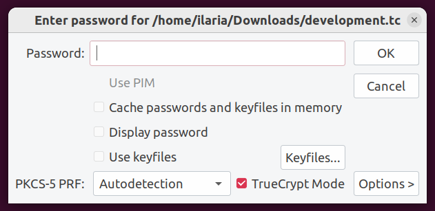

# [TrueSecrets](https://app.hackthebox.com/challenges/TrueSecrets) Writeup [HTB]
_Forensics_

## Introducing the challenge
In _TrueSecrets_, I'm given yet another memory dump. The lore is intense:

>Our cybercrime unit has been investigating a well-known APT group for several months. The group has been responsible for several high-profile attacks on corporate organizations. However, what is interesting about that case, is that they have developed a custom command & control server of their own. Fortunately, our unit was able to raid the home of the leader of the APT group and take a memory capture of his computer while it was still powered on.

My objective is to find the source code of the server.

## Beginning the investigation!
I take out my faithful `volatility` and I begin with finding the profile of the machine:
```sh
$ volatility -f TrueSecrets.raw imageinfo
Volatility Foundation Volatility Framework 2.6.1
INFO    : volatility.debug    : Determining profile based on KDBG search...
          Suggested Profile(s) : Win7SP1x86_23418, Win7SP0x86, Win7SP1x86_24000, Win7SP1x86
                     AS Layer1 : IA32PagedMemoryPae (Kernel AS)
                     AS Layer2 : FileAddressSpace (/home/ilaria/Downloads/TrueSecrets.raw)
                      PAE type : PAE
                           DTB : 0x185000L
                          KDBG : 0x82732c78L
          Number of Processors : 1
     Image Type (Service Pack) : 1
                KPCR for CPU 0 : 0x82733d00L
             KUSER_SHARED_DATA : 0xffdf0000L
           Image date and time : 2022-12-14 21:33:30 UTC+0000
     Image local date and time : 2022-12-14 13:33:30 -0800
```
I choose `Win7SP1x86_23418`. 

Now, I have to start investigating the memory dump. First, I want to see what the leader-guy run on the command line when the raid happened. If the source code was on their machine, trying to protect it before being arrested makes a lot of sense to me.

```sh
s$ volatility -f TrueSecrets.raw --profile=Win7SP1x86_23418 cmdline
Volatility Foundation Volatility Framework 2.6.1
[...]
************************************************************************
TrueCrypt.exe pid:   2128
Command line : "C:\Program Files\TrueCrypt\TrueCrypt.exe" 
************************************************************************
svchost.exe pid:   2760
Command line : C:\Windows\System32\svchost.exe -k secsvcs
************************************************************************
WmiPrvSE.exe pid:   2332
Command line : C:\Windows\system32\wbem\wmiprvse.exe
************************************************************************
taskhost.exe pid:   2580
Command line : 
************************************************************************
7zFM.exe pid:   2176
Command line : "C:\Program Files\7-Zip\7zFM.exe" "C:\Users\IEUser\Documents\backup_development.zip"
************************************************************************
DumpIt.exe pid:   3212
Command line : "C:\Users\IEUser\Downloads\DumpIt.exe" 
************************************************************************
conhost.exe pid:    272
Command line : \??\C:\Windows\system32\conhost.exe "-180402527637560752-8319479621992226886-774806053592412399-20651748-101374072
```
There are a couple of interesting things here:
- First, the leader zipped something in `backup_development.zip`;
- Then, he launched `DumpIt.exe`.

Since I'm specifically looking for the server _source code_, the zip archive looks more promising. I want to know more.

## Extracting the archive
In order to recover the archive, I first need to find its position in the dump. This can be done by using `filescan`.
```sh
$ volatility -f TrueSecrets.raw --profile=Win7SP1x86_23418 filescan | grep development
Volatility Foundation Volatility Framework 2.6.1
0x000000000bbf6158      3      1 R--r-- \Device\HarddiskVolume1\Users\IEUser\Documents\backup_development.zip
0x000000000c50c550      2      1 RW---- \Device\HarddiskVolume1\Users\IEUser\Documents\development.tc
```
Once I know the position a file, I can use `dumpfiles` to extract it. I first try with `development.tc`, but I don't get any output. I then pass to `backup_development.zip`.
```sh
$ volatility -f TrueSecrets.raw --profile=Win7SP1x86_23418 dumpfiles -Q 0x000000000bbf6158 --name file -D .
Volatility Foundation Volatility Framework 2.6.1
DataSectionObject 0x0bbf6158   None   \Device\HarddiskVolume1\Users\IEUser\Documents\backup_development.zip
SharedCacheMap 0x0bbf6158   None   \Device\HarddiskVolume1\Users\IEUser\Documents\backup_development.zip
```
Once I have the file on my machine, I extract it to see its content: it's `development.tc`!

## Falling in the TrueCrypt rabbithole
I have never heard of the `.tc` extension, but a quick search on the internet reveals that it's a TrueCrypt file. Clearly, I have also never heard of TrueCrypt. According to [Wikipedia](https://en.wikipedia.org/wiki/TrueCrypt),

>TrueCrypt is a discontinued source-available freeware utility used for on-the-fly encryption (OTFE). It can create a virtual encrypted disk within a file, encrypt a partition, or encrypt the whole storage device (pre-boot authentication).

So, in this case, the leader used their last commands to encrypt the server code and zip it. So, now I need two things:
- Find the encryption password;
- Mount the disk and read its content.

**Spoiler alert!** One of them is going to be much more difficult than the other one.

### Finding the password
Ironically, finding the password is so easy it requires only one instruction: `volatility` has a dedicated plugin for that.
```sh
$ volatility -f TrueSecrets.raw --profile=Win7SP1x86_23418 truecryptpassphrase
Volatility Foundation Volatility Framework 2.6.1
Found at 0x89ebf064 length 28: X2Hk2XbEJqWYsh8VdbSYg6WpG9g7
```

### Mounting the disk
This is where the fun begins. And by "fun", I mean "torture". 

A tiny detail about TrueCrypt that I forgot to mention is that it's been discontinued since 2014. Luckily, VeraCrypt (a fork of TrueCrypt) is still maintained. 
I install VeraCrypt and use it to mount the file. Problem is, it just wouldn't work. 

I really don't understand what's causing this. Maybe the password is wrong? The file is corrupted? Am I missing something?

After 30 minutes of desperation, I realize what was wrong. It was VeraCrypt all along.

To sum it up, it looks like VeraCrypt had a TrueCrypt legacy mode, which should be used to mount TrueCrypt files. This mode was present until version 1.25.9, and later removed. So I uninstall VeraCrypt, download the Linux generic installer for v1.25.9 from [the official website](https://veracrypt.eu/en/Downloads_1.25.9.html), unzip it and run the `veracrypt-1.25.9-setup-gui-x64` script.

Finally, I run the "mount" command and see that sweet "TrueCrypt Mode" checkbox:
```
$ veracrypt --mount development.tc ../development
```


**[TL;DR]** If you don't see that checkbox, you have the wrong installation!

## Analyzing the source code
Now that the volume is mounted, I can finally investigate its content. Specifically, it contains:
- The source code of the server, in C#;
- A `sessions` folder, containing 3 files.

I start with the session files. Each file contains some base-64-encoded entries. Some entries are present in multiple files, some are specific to a single one. However, simply decoding them doesn't yield any interesting result. Time to look at the server code.

The code reveals that the session files contain some command logs, encoded with the following function:
```cs 
private static string Encrypt(string pt) {
    string key = "AKaPdSgV";
    string iv = "QeThWmYq";
    byte[] keyBytes = Encoding.UTF8.GetBytes(key);
    byte[] ivBytes = Encoding.UTF8.GetBytes(iv);
    byte[] inputBytes = System.Text.Encoding.UTF8.GetBytes(pt);
    
    using (DESCryptoServiceProvider dsp = new DESCryptoServiceProvider()) {
        var mstr = new MemoryStream();
        var crystr = new CryptoStream(mstr, dsp.CreateEncryptor(keyBytes, ivBytes), CryptoStreamMode.Write);
        crystr.Write(inputBytes, 0, inputBytes.Length);
        crystr.FlushFinalBlock();
        return Convert.ToBase64String(mstr.ToArray());
    }
}
```
I then ask kindly to ChatGPT to write me a correspondent decrypt function in Python:
```py
# Thanks ChatGPT <3
from Crypto.Cipher import DES
import base64

def decrypt(ciphertext):
    key = "AKaPdSgV".encode('utf-8')  # Same key as used in C#
    iv = "QeThWmYq".encode('utf-8')   # Same IV as used in C#
    # Decode the base64-encoded ciphertext
    encrypted_bytes = base64.b64decode(ciphertext)
    # Initialize the DES cipher in CBC mode with the given key and IV
    des = DES.new(key, DES.MODE_CBC, iv)
    # Decrypt the ciphertext
    decrypted_bytes = des.decrypt(encrypted_bytes)
    # Remove padding (assuming PKCS5/PKCS7 padding is used)
    padding_length = decrypted_bytes[-1]
    decrypted_bytes = decrypted_bytes[:-padding_length]
    # Convert the decrypted bytes back to a string
    decrypted_text = decrypted_bytes.decode('utf-8')
    return decrypted_text
```
I feed it the content of the three session files, run the script and get the flag!
```
Cmd: hostname
DESKTOP-MRL1A9O
Cmd: whoami
desktop-mrl1a9o\john
Cmd: dir c:\users\john\documents
 Volume in drive C is Windows 7
 Volume Serial Number is 1A9Q-0313
 Directory of C:\Users\john\Documents
12/13/2022  08:15 AM    <DIR>          .
12/13/2022  08:15 AM    <DIR>          ..
               0 File(s)              0 bytes
               2 Dir(s)  25,422,577,664 bytes free
Cmd: hostname
DESKTOP-MRL1A9O
Cmd: whoami
desktop-mrl1a9o\paul
Cmd: dir c:\users\paul\documents
 Volume in drive C is Windows 7
 Volume Serial Number is 1A9Q-0313
 Directory of C:\Users\paul\Documents
12/13/2022  08:15 AM    <DIR>          .
12/13/2022  08:15 AM    <DIR>          ..
               0 File(s)              0 bytes
               2 Dir(s)  25,422,577,664 bytes free
Cmd: hostname
DESKTOP-MRL1A9O
Cmd: whoami
desktop-mrl1a9o\greg
Cmd: dir c:\users\greg\documents
 Volume in drive C is Windows 7
 Volume Serial Number is 1A9Q-0313
 Directory of C:\Users\greg\Documents
12/13/2022  09:07 AM    <DIR>          .
12/13/2022  09:07 AM    <DIR>          ..
12/13/2022  09:15 AM                41 flag.txt
               1 File(s)             41 bytes
               2 Dir(s)  25,326,063,616 bytes free
Cmd: type c:\users\greg\documents\flag.txt
HTB{<REDACTED>}
```
